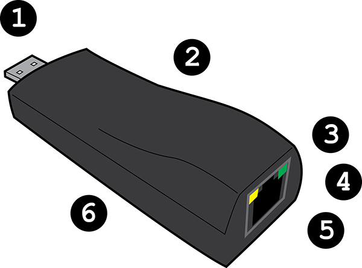
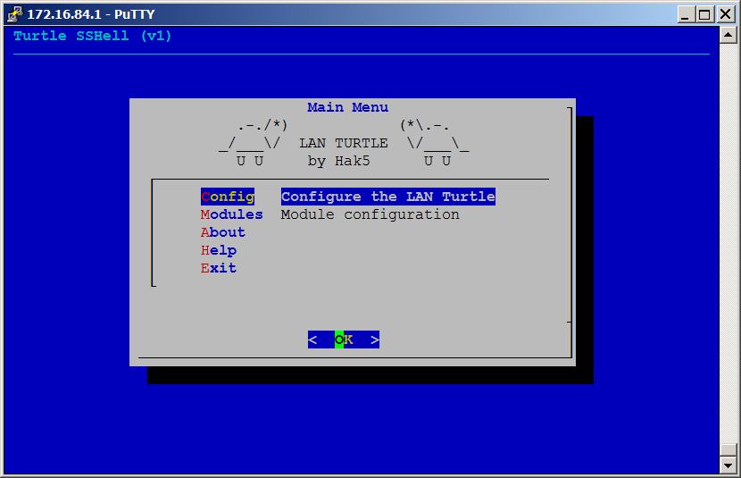
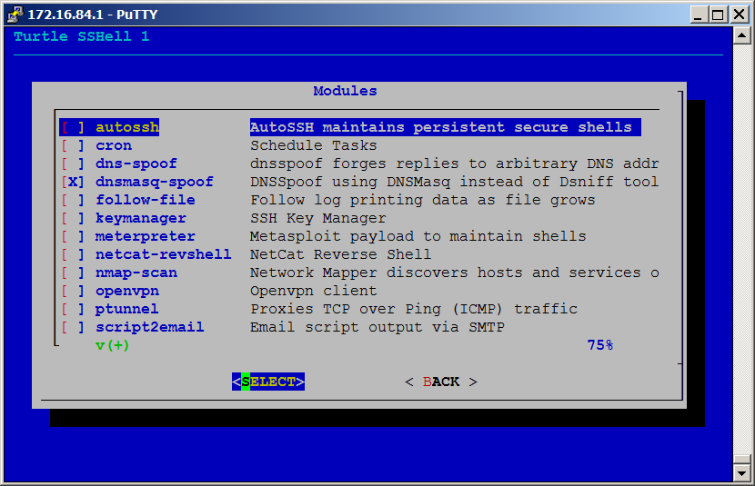
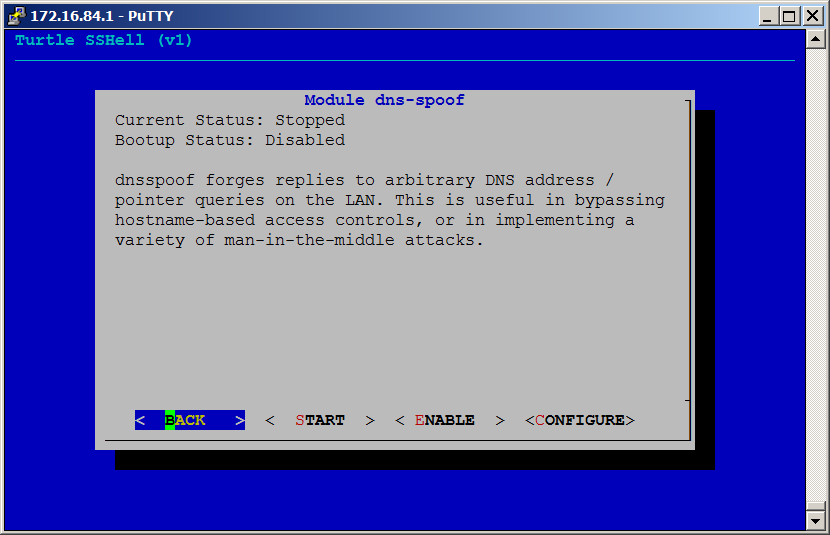
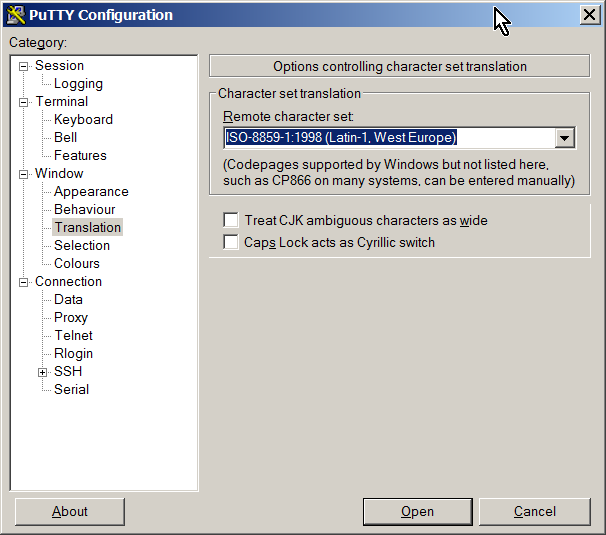
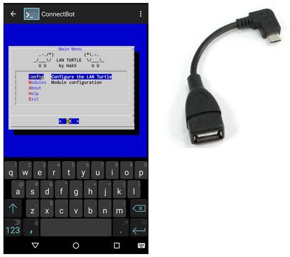

##About the LAN Turtle

**Drop a LAN Turtle. Get a Shell.**

The LAN Turtle is a covert Systems Administration and Penetration Testing tool providing stealth remote access, network intelligence gathering, and man-in-the-middle monitoring capabilities. 

Housed within a generic "USB Ethernet Adapter" case, the LAN Turtle’s covert appearance allows it to blend into many IT environments.

---

##Purchase
* The USB Rubber Ducky is available from [The HakShop](http://www.hakshop.com/lanturtle).

---

##Use Cases

The LAN Turtle is exceptionally good at providing: 

* Remote Access
* Network Intelligence
* Man-in-the-Middle

Deployment scenarios may include:

* Covertly installed inside a corporate network to provide the penetration tester with remote access via Metasploit's Meterpreter.
* Surreptitiously installed on a target computer to poison DNS, providing the penetration tester with possible phishing endpoints.
* Secretly installed between a target computer and LAN to intercept and log web traffic.
* Exfiltrate shared data from within the host LAN to an outside SSH filesystem.
* Act as an OpenVPN Gateway in to the host LAN allowing the systems administrator to manage or the penetration tester to audit all nodes accessible to the LAN Turtle remotely.
* Quickly initiate an automated map of the target network and provide a report to the penetration tester either on the device or delivered by email or HTTP.
* Provide a persistent reverse shell over SSH through an intermediate server for remote access to an internal network. 
* Masquerade as a legitimate USB Ethernet adapter while performing any automated attack against the host computer or network using tools cross-compiled for the LAN Turtle's Linux-based OS.

---

##LAN Turtle Inside and Out

* USB Ethernet and Power
 * Enumerates on the host computer as a generic USB Ethernet device. The onboard Linux-based system uses this Interface (eth0) to offer the host computer an IP address via DHCP.
* Covert Case
 * Generic USB Ethernet Adapter case blends into the target network environment allowing for concealment behind desktops, in telephone closets and server racks.
* Ethernet
 * Standard Ethernet port (eth1) set to obtain an IP address from the host LAN DHCP server. If present, will bridge with a host PC connected to the USB (eth0) port.
* Green Power Indicator LED
* Amber Status Indicator LED
* Reset Button (Inside Case)
 * Press to reset to default configuration
 * Hold while powering on to access HTTP firmware recovery

---

##Turtle Shell
The LAN Turtle is managed through the Turtle Shell - a text based, menu-driven graphical user interface accessible by SSH.  The menus may be navigated using standard arrow, tab, escape and return keys as well as mouse in most terminals. 

The Turtle Shell's Configuration Menu provides the ability to change advanced settings such as Password, MAC address, IP address. Firmware updates may be checked for and installed as they become available.

By default the Turtle Shell will start at login via SSH unless disabled from the Configuration Menu.

Exiting the Turtle Shell returns the user to the LAN Turtle's bash shell. To return to the Turtle Shell, run the "turtle" command.

---

##Turtle Modules
The LAN Turtle uses a modular system for managing its various tools and services. Turtle modules may be started, stopped, enabled, disabled or configured from the Module Menu. 

###Configure
Configuring a module typically involves entering data specific to your deployment. For example, when configuring the Meterpreter module, you must specify the listening host and port. When configuring the Nmap module you must specify a target, profile and log. Configuration changes made through the graphical Turtle Shell are generally saved in config files and are persistent upon reboot.

###Start / Stop
Once configured, a module may be Started or Stopped from the Module Menu. Generally a module may not be started until it has been configured. Some modules, such as the SSH Key Manager, do not support starting and only allow for configuration. Some modules stay running once started. For instance the autossh module will maintain a persistent secure shell until stopped. Other modules will start a task then stop when completed, such as script2email or nmap-scan.

###Enable / Disable
Modules may be set to start up once the LAN Turtle has booted. For example an OpenVPN session may be established upon power-up by first configuring the module and testing it using the start and stop feature. Once the module is achieving the desired result, the module may be Enabled from the Module Menu. Now the LAN Turtle can be deployed on a target network with the OpenVPN module establishing a connection without intervention from the user. An enabled module will start on every boot unless disabled from the Module Menu.

###Additional Modules
The LAN Turtle is designed to enable rapid module development. Any supported language (such as bash, php, or python) may be used to write a Turtle Module. With just a few core functions required, modules may be quickly developed and tested. Once submitted to the LAN Turtle Module Repository, they may become available for other LAN Turtle users to download and enjoy. For more information on writing modules, consult the developer documentation at LANTurtle.com

---

##Connecting for the first time
When configuring the LAN Turtle for the first time, a direct connection to the operator's notebook or desktop computer is recommended. The USB plug will both power the LAN Turtle (as indicated by the Green LED) as well as expose a USB Ethernet adapter to the computer for management.

Once connected to the operator's computer via USB, the LAN Turtle will boot. The boot sequence completes in about 30 seconds, during which the the Amber LED will blink. The first time the LAN Turtle is plugged in, the Amber LED will continue blinking until initial configuration is completed via SSH.

Once bootup is complete, the LAN Turtle's network interface on the USB facing side will offer the host computer an IP address via DHCP. 

Ensure the host computer is configured to accept IP from DHCP, or alternatively specify a static address in the LAN Turtle's IP range.

Once the LAN Turtle has completely booted and the host computer has been assigned an IP address, the operator may access the LAN Turtle's Shell via SSH.

####Default IP, Port, Username and Password

* IP Address: 172.16.84.1
* Port: 22 		*SSH default*
* Username: root
* Password: sh3llz 	*Must change on initial setup*

---

##SSH Clients
The LAN Turtle is managed via the Turtle Shell, accessible via SSH.

###Linux and Mac
Linux and Mac operators are recommended to use the built in SSH client (typically openssh). With the LAN Turtle plugged into the user's PC, an SSH connection is usually initiated by issuing "**ssh root@172.16.84.1**" from the terminal.

###Windows
Since Microsoft does not bundle an SSH client with Windows by default, Windows users are encouraged to use the open source PuTTY client from: http://www.chiark.greenend.org.uk/~sgtatham/putty 

Please Note: for the best experience, choose ISO-8859-1 Remote character set from Window > Translation. Otherwise the menu outlines may seem garbled.

###Android
For quick access and configuration changes in the field, the LAN Turtle's Shell can be accessed from an Android Tablet or Smartphone by using a USB OTG cable and SSH client. **ConnectBot** is a free open source Secure Shell client available in the Google play store.

---

##Power Considerations

The LAN Turtle is powered via USB and requires 5V at ~200mA. Typical power usage is 1 Watt. Below are some example deployment scenarios and power considerations.

* Covertly installed in an available USB port on the back of a desktop computer at a client site, either in an "Ethernet Pass-through" configuration (With Network access provided by the LAN Turtle) or standalone (such as for DNS Poisoning).
* Concealed in a network closet plugged into Ethernet powered by a USB Battery Pack. For example: the Pineapple Juice 15000 USB Battery from HakShop.com would power the LAN Turtle for ~3 days.
* Concealed in a telephone room plugged into a free Ethernet cable powered by a typical smartphone USB wall charger.
* Concealed in a server rack powered by a server's available USB port using a USB Data Blocker inline USB dongle (Available from HakShop.com) to prevent the server's operating system from identifying the LAN Turtle.
* Connected to a penetration tester's Android tablet or smartphone using a USB OTG cable (available from HakShop.com) for use on-the-go with an Android SSH client. Note: Some smartphones and tablets do not provide the current necessary to power the LAN Turtle. Most Nexus models have been tested to function properly.
